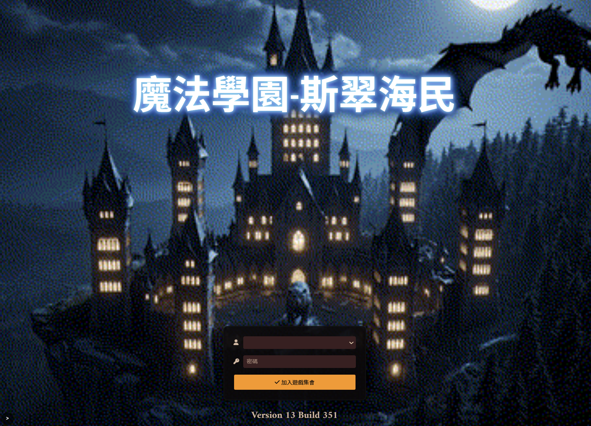

# Foundry VTT Login Page Customizer

[](https://github.com/zeteticl/foundryVTT-login-page-customizer/releases)
[](https://github.com/zeteticl/foundryVTT-login-page-customizer/releases)
[](https://github.com/zeteticl/foundryVTT-login-page-customizer/commits/main)
[](https://github.com/zeteticl/foundryVTT-login-page-customizer)



A cross-platform Node.js CLI that patches [Foundry Virtual Tabletop](https://foundryvtt.com/)'s login/setup page. Customize the join screen with video backgrounds, compact layout, custom logo, title styling, and more.

## Features

- **Hide role-none users** — Users whose role is "none" are not shown in the join list
- **Video background** — Use video files as join/setup page backgrounds (with base-world patch). Supported formats: **MP4** (`.mp4`, `.m4v`), **WebM** (`.webm`), **Ogg** (`.ogv`). Playback depends on the browser’s HTML5 `<video>` support; MP4 (H.264) and WebM are widely supported.
- **Setup toggle** — Admin panel with collapse button `<` (angle bracket) to return to setup
- **Hide panels** — Optionally hide world description and game details panels
- **Single-row UI** — Compact, centered layout for the join form
- **Remove join heading** — Remove the "Join Game Session" heading
- **Main logo override** — Replace or remove the main logo via `--main-logo` CSS variable
- **Title glow** — Apply text-shadow styles with 8 built-in color palettes
- **Title font size** — Customize the title font size
- **Backup & restore** — Automatic backup before patching; restore mode to revert to original files

## Requirements

- **Node.js** (LTS recommended)
- Foundry VTT (tested v13.x; profile v13.351 included)

## Install & run

### Windows (PowerShell 5.1)

1. **Pick a folder** (recommended) — Use something like `C:\Games\foundry-tools\` (avoid `Program Files`).
2. **(Optional) Open PowerShell as Administrator** — Only needed if your Foundry install is under `C:\Program Files\...` and you run into permission errors while patching.  
   - Start Menu → type `powershell` → right-click **Windows PowerShell** → **Run as administrator**
3. **Download the latest release zip** into that folder:

```powershell
mkdir C:\Games\foundry-tools -Force
cd C:\Games\foundry-tools
Invoke-WebRequest -Uri "https://github.com/zeteticl/foundryVTT-login-page-customizer/releases/latest/download/foundryVTT-login-page-customizer.zip" -OutFile "foundryVTT-login-page-customizer.zip"
```

4. **Extract**:

```powershell
Expand-Archive -Path "foundryVTT-login-page-customizer.zip" -DestinationPath ".\\foundryVTT-login-page-customizer" -Force
cd .\\foundryVTT-login-page-customizer
```

5. **Run**:

```bat
.\fvtt-login-patcher.cmd
```

### Linux

1. **Pick a folder** (recommended) — e.g. `~/foundry-tools/`.
2. **Download + extract** the latest release zip:

```bash
mkdir -p ~/foundry-tools
cd ~/foundry-tools
curl -L -o foundryVTT-login-page-customizer.zip \
  https://github.com/zeteticl/foundryVTT-login-page-customizer/releases/latest/download/foundryVTT-login-page-customizer.zip
unzip -o foundryVTT-login-page-customizer.zip -d foundryVTT-login-page-customizer
cd foundryVTT-login-page-customizer
```

3. **(Once) Allow execution**:

```bash
chmod +x fvtt-login-patcher.sh
```

4. **Run**:

```bash
./fvtt-login-patcher.sh
```

If you still get **Permission denied**, run via Node:

```bash
node src/fvtt-login-patcher.mjs
```

### macOS

1. **Pick a folder** (recommended) — e.g. `~/foundry-tools/`.
2. **Download + extract** the latest release zip:

```bash
mkdir -p ~/foundry-tools
cd ~/foundry-tools
curl -L -o foundryVTT-login-page-customizer.zip \
  https://github.com/zeteticl/foundryVTT-login-page-customizer/releases/latest/download/foundryVTT-login-page-customizer.zip
unzip -o foundryVTT-login-page-customizer.zip -d foundryVTT-login-page-customizer
cd foundryVTT-login-page-customizer
```

3. **(Once) Allow execution**:

```bash
chmod +x fvtt-login-patcher.sh
```

4. **Run**:

```bash
./fvtt-login-patcher.sh
```

If you still get **Permission denied**, run via Node:

```bash
node src/fvtt-login-patcher.mjs
```

### Follow prompts

Choose your Foundry app path, select **Modify** or **Restore**, then options. Backups are `*.bak.orig`; use **Restore** to undo.

## Version support

The patcher reads Foundry version from `package.json` and uses a profile under `src/HTML/` (e.g. `v13.351`). For other builds, add or edit a profile in that folder.

## Project structure

```
src/
├── fvtt-login-patcher.mjs   # Main script
├── fvtt-login-patcher.cmd   # Windows launcher
├── fvtt-login-patcher.sh    # Unix launcher
└── HTML/v13.351/            # Profile (profile.json, snippets/)
```

## Credits

- **xtlcme** — Original idea: [女神幻想論壇 — Foundry 登入頁自訂](https://www.goddessfantasy.net/bbs/index.php?topic=126755.0)

## Disclaimer

This tool modifies files inside your Foundry installation. Backups are created automatically; use **Restore** to undo. Updating Foundry may overwrite patched files — re-run the patcher after upgrading if you want to keep your customizations.
